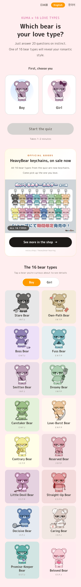
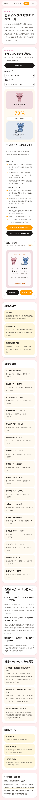
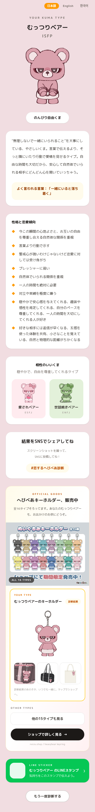

<p align="center">
  <a href="https://kumatype-shindan.xyz">
    
  </a>
</p>

# Kuma Type Shindan Data

Public data, image assets, and scoring rules for the independent [Kuma Type Shindan guide](https://kumatype-shindan.xyz). This repository is for people who want to inspect the 20-question Kuma love-type scoring model, the 16 bear-type records, compatibility rules, and public reference assets without receiving the private website application source.

This is not the full Next.js website source. It does not include deployment configuration, environment files, analytics setup, payment code, internal UI components, or private operational material.

## Visual Preview

| Surface | Preview |
| --- | --- |
| Quiz home |  |
| 16 type list |  |
| Compatibility tool |  |
| Result page |  |

## Repository Contents

| Resource | Description |
| --- | --- |
| [questions.json](data/questions.json) | The 20 public quiz questions with axis and positive-pole metadata. |
| [kuma-types.json](data/kuma-types.json) | All 16 Kuma type records, including names, slugs, descriptions, groups, result images, traits, and primary compatibility links. |
| [asset-manifest.json](data/asset-manifest.json) | Public image and font source metadata carried over from the guide project. |
| [scoring.mjs](src/scoring.mjs) | Open scoring and compatibility helper implementation. |
| [assets/images/kuma](assets/images/kuma) | Public Kuma type, result, and product-reference images used by the guide. |
| [scoring documentation](docs/scoring.md) | Human-readable explanation of the result and compatibility calculations. |
| [public boundary](docs/public-boundary.md) | What this repository intentionally includes and excludes. |

## Links

| Destination | Link |
| --- | --- |
| Official guide website | [Kuma Type Shindan guide](https://kumatype-shindan.xyz) |
| English guide homepage | [KUMA Love Type Quiz Guide](https://kumatype-shindan.xyz/en) |
| 16 type hub | [Kuma Type 16 results list](https://kumatype-shindan.xyz/types) |
| Compatibility guide | [Kuma Type compatibility tool](https://kumatype-shindan.xyz/compatibility) |
| Primary GitHub repository | [Kuma Type Shindan Data on GitHub](https://github.com/kumatype-shindan/kuma-type-data) |

## Scoring Summary

Answers are expected as numbers from `-2` to `2`. Each question belongs to one axis: `EI`, `SN`, `TF`, or `JP`. Positive answers add points to the question's positive pole. Negative answers add points to the opposite pole. The final result code is built from the winning pole on each axis.

When an axis is tied, the published implementation chooses the second pole because comparisons use `>` rather than `>=`. A fully neutral answer set therefore resolves to `INFP`.

```js
import questions from "./data/questions.json" with { type: "json" };
import { calculateKumaResultCode } from "./src/scoring.mjs";

const resultCode = calculateKumaResultCode([2, 1, 0, -1, -2], questions);
```

Run the public checks with:

```bash
npm test
```

## Boundary

Included:

- 20 questions and axis metadata.
- 16 Kuma type records.
- Compatibility pair scoring rules.
- Public image assets and selected preview screenshots.
- Tests proving the data shape and public boundary.

Excluded:

- `.env` files and deployment secrets.
- Website application source such as Next.js routes and UI components.
- Google Analytics, payment, checkout, database, or provider configuration.
- Debug captures and local runtime artifacts.

## Independence Notice

The Kuma Type Shindan guide is an independent guide for people searching for KUMA x 16 LOVE TYPES, result lists, and compatibility explanations. It is not operated by the official KUMA site, NOIZU, or the rights holders.

