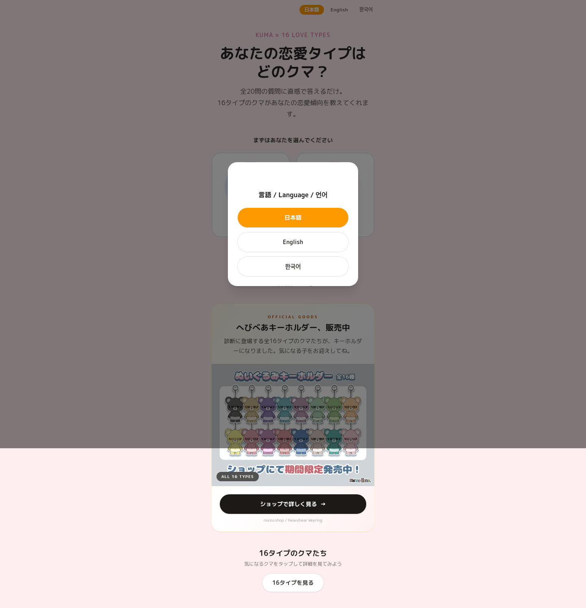

<p align="center">
  <a href="https://kumatype-shindan.xyz">
    
  </a>
</p>

<h1>
  Kuma Type Shindan データ
  <a href="README.zh-CN.md"></a>
  <a href="README.en.md"></a>
  <a href="README.md"></a>
</h1>

この日本語 README が公式基準です。翻訳版との差異がある場合は、この日本語版を優先します。

Kuma Type Shindan データは、独立したクイズ・参考サイト [恋するへびべあ診断](https://kumatype-shindan.xyz) の公開データ、画像アセット、スコアリングルールを確認するためのリポジトリです。開発者、クイズ制作者、翻訳レビュー担当者、利用者が、20問の Kuma 恋愛タイプ診断、16種類のベアタイプ、タイプ一覧、相性スコア、公開参考アセットを確認できます。

これは Next.js で動く本番サイト全体のソースコードではありません。デプロイ設定、環境変数、アナリティクス、決済コード、内部 UI コンポーネント、非公開の運用資料は含みません。

## このリポジトリの目的

Kuma Type Shindan はブラウザで使える診断と公開参考サイトですが、クイズデータとスコア計算のふるまいは、本番アプリを公開しなくても確認できるべきです。この公開パッケージには次の内容が含まれます。

- 質問、タイプ、相性、スコアリングの透明な公開データ。
- ドキュメント確認用の公開画像とスクリーンショット。
- 公開されている結果計算を再現する小さなスコアリングヘルパー。
- 公開パッケージの形と private/source 境界を守るテスト。
- データ修正、ドキュメント修正、公開アセットのフィードバック用ルート。

## 公式サイトの機能

- 恋するへびべあ診断: 20問・1〜2分で、16種類のクマ恋愛タイプを確認できます。
- 16タイプ一覧: 各タイプの名前、MBTI風コード、恋愛傾向、相性の見方を見直せます。
- 相性診断: 自分と相手のクマタイプを選び、相性スコアと読み方を確認できます。
- ラブタイプ診断64: 恋愛での距離感、甘え方、現実感、自由さなどから、64タイプの恋愛キャラクター結果を見られる新しい診断です。
- ラブタイプ診断64の結果一覧: 64タイプの画像、タイプコード、恋愛傾向を一覧で確認できます。
- 3D KUMA: 16タイプをぬいぐるみ風・クレイフィギュア風の3D画像で見比べられます。

## 更新履歴

- 2026-07: ラブタイプ診断64を追加し、64タイプの恋愛キャラクター診断と結果一覧を公開しました。
- 2026-07: ラブタイプ診断64の結果ページとシェア画像まわりを整備しました。
- 2026-07: READMEを日本語基準にし、英語版と簡体中文版を追加しました。
- 2026-07: READMEのホームプレビュー画像を、言語選択モーダルのないクリーンな首屏画像に更新しました。

## データとツール

| リソース | 目的 | 主な内容 | パス |
| --- | --- | --- | --- |
| 質問データ | クイズモデル確認 | 20問の質問、軸、positive pole メタデータ | `data/questions.json` |
| Kuma タイプ | 結果コンテンツ確認 | 16タイプの名前、slug、説明、特徴、グループ、相性リンク | `data/kuma-types.json` |
| アセット manifest | 公開アセット確認 | サイトプロジェクトから持ち出した画像・フォントの出典メタデータ | `data/asset-manifest.json` |
| スコアリングヘルパー | 結果再現 | 結果コードと相性計算の公開 JavaScript ヘルパー | `src/scoring.mjs` |
| スコアリング仕様 | 人間向けルール | 軸スコア、同点時の挙動、相性スコア、ラベル | `docs/scoring.md` |
| 公開境界 | public/private 分離 | このリポジトリに含めるものと除外するもの | `docs/public-boundary.md` |
| 公開チェック | 回帰防止 | スコアリングと公開境界の Node テスト | `tests/` |

## 使いどころ

- どの質問が `EI`、`SN`、`TF`、`JP` のどの軸に対応するか確認する。
- ライブサイトの外で結果コード計算を再現する。
- 16種類の Kuma タイプと公開相性関係をレビューする。
- すべて中立回答のときに `INFP` へ解決される理由を確認する。
- 非公開のアカウント情報やセキュリティ情報を出さずに、公開データやドキュメントの修正を報告する。

## はじめ方

1. `data/` のデータファイル、特に `data/questions.json` と `data/kuma-types.json` を確認します。
2. `docs/scoring.md` を読むか、`src/scoring.mjs` を import して結果計算を再現します。
3. データやスコアリングの変更を提案する前に公開チェックを実行します。

```bash
npm test
```

## プレビュー



追加の公開スクリーンショットとして、[16タイプ一覧](assets/screenshots/types-mobile.png)、[相性診断](assets/screenshots/compatibility-mobile.png)、[結果ページ](assets/screenshots/result-mobile.png) があります。

## 公式リンク

| 目的 | リンク |
| --- | --- |
| 公式診断サイト | [恋するへびべあ診断](https://kumatype-shindan.xyz) |
| 英語版ホーム | [KUMA Love Type Quiz](https://kumatype-shindan.xyz/en) |
| 16タイプ一覧 | [くまタイプ診断 MBTI 16タイプ一覧](https://kumatype-shindan.xyz/types) |
| 相性診断 | [くまタイプ相性一覧](https://kumatype-shindan.xyz/compatibility) |
| 主 GitHub リポジトリ | [Kuma Type Shindan Data on GitHub](https://github.com/kumatype-shindan/kuma-type-data) |
| サポート案内 | [SUPPORT.md](SUPPORT.md) |
| セキュリティ報告 | [SECURITY.md](SECURITY.md) |

## 公式ミラー

GitHub が canonical な公開リポジトリです。ほかのミラーは、プラットフォーム別の発見性と公開してよいフィードバックのために用意しています。

| プラットフォーム | リンク | 目的 |
| --- | --- | --- |
| GitHub | [kumatype-shindan/kuma-type-data](https://github.com/kumatype-shindan/kuma-type-data) | canonical 公開データパッケージ |
| GitLab | [GitLab の kuma-type-data](https://gitlab.com/nano-products/kuma-type-data) | GitLab 向けミラーと issue 文脈 |
| Codeberg | [Codeberg の kuma-type-data](https://codeberg.org/nano-products/kuma-type-data) | Forgejo/Codeberg 向け発見ミラー |
| Gitee | [Gitee の kuma-type-data](https://gitee.com/nano-products/kuma-type-data) | 中国語プラットフォーム向けミラー |
| GitCode | [GitCode の kuma-type-data](https://gitcode.com/weixin_52314137/kuma-type-data) | 中国語開発者向け発見ミラー |
| Bitbucket | [Bitbucket の kuma-type-data](https://bitbucket.org/nano-products/kuma-type-data) | Bitbucket 向けミラー |
| SourceHut | [SourceHut の kuma-type-data](https://git.sr.ht/~chrisv/kuma-type-data) | clone-first ミラー |
| Launchpad | [Launchpad の kuma-type-data](https://code.launchpad.net/~nano-products/+git/kuma-type-data) | ブランチ指向ミラー |
| Disroot Git | [Disroot Git の kuma-type-data](https://git.disroot.org/nano-products/kuma-type-data) | 低ノイズのミラー |

## スコアリング

回答は `-2` から `2` の数値です。各質問は `EI`、`SN`、`TF`、`JP` のいずれかの軸に属します。positive な回答は質問の positive pole に加点され、negative な回答は反対側の pole に加点されます。最終結果コードは各軸で勝った pole を組み合わせて作られます。

同点の場合、公開実装は `>=` ではなく `>` を使うため、2番目の pole を選びます。すべて中立回答にすると `INFP` になります。

```js
import questions from "./data/questions.json" with { type: "json" };
import { calculateKumaResultCode } from "./src/scoring.mjs";

const resultCode = calculateKumaResultCode([2, 1, 0, -1, -2], questions);
```

## 公開境界

含まれるもの:

- 20問の質問と軸メタデータ。
- 16種類の Kuma タイプ。
- 相性ペアのスコアリングルール。
- 公開画像アセットと一部のプレビュー用スクリーンショット。
- データ形状と公開境界を検証するテスト。

含まれないもの:

- `.env` ファイルやデプロイ secrets。
- Next.js routes や UI components などのサイトアプリケーションソース。
- Google Analytics、決済、checkout、database、provider 設定。
- デバッグキャプチャやローカル実行アーティファクト。

## サポートとセキュリティ

質問データ、タイプ情報、相性の挙動、公開アセット、ドキュメントに関する公開してよい修正は GitHub Issues を使ってください。

非公開のアカウント情報、決済情報、アナリティクス出力、セキュリティ脆弱性、private logs、本番サイトの非公開ソースを public issue に投稿しないでください。非公開サポートやセキュリティに関わる報告は [Kuma Type Shindan support](mailto:support@kumatype-shindan.xyz) へ送ってください。

## 独立性について

Kuma Type Shindan は、KUMA x 16 LOVE TYPES、Kuma love type quiz questions、16 Kuma type records、result lists、compatibility score explanations を探す人向けの独立したクイズ・参考サイトです。公式 KUMA サイト、NOIZU、または権利者によって運営されているものではありません。
